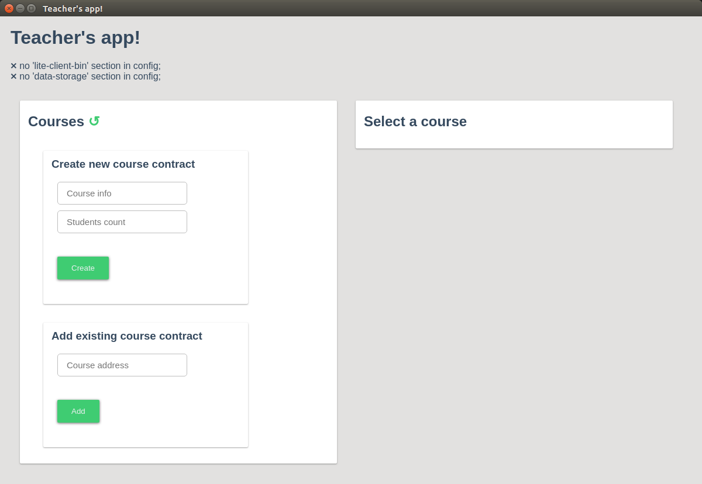
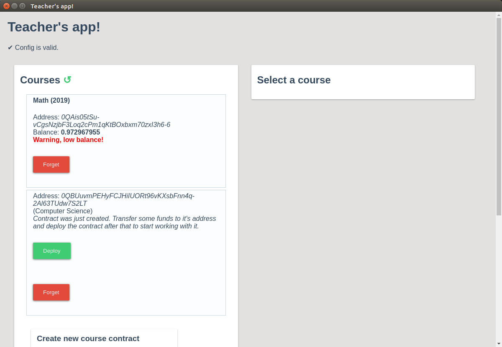
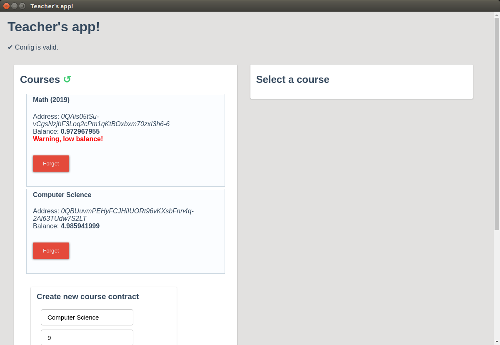
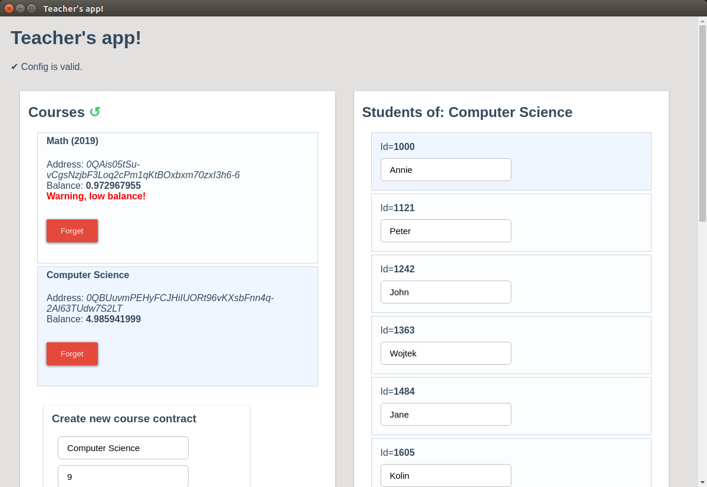
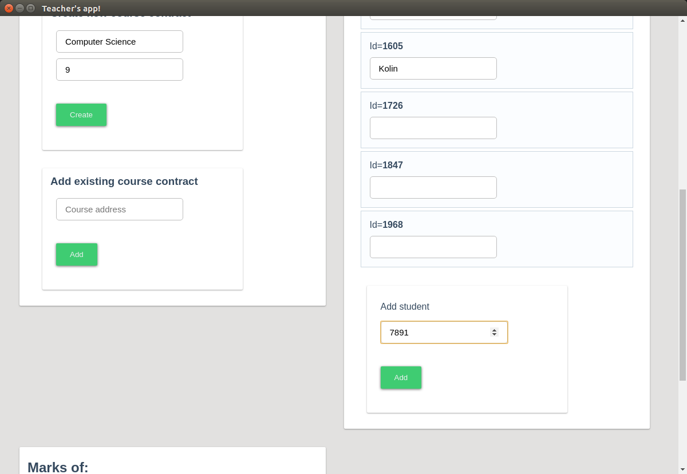
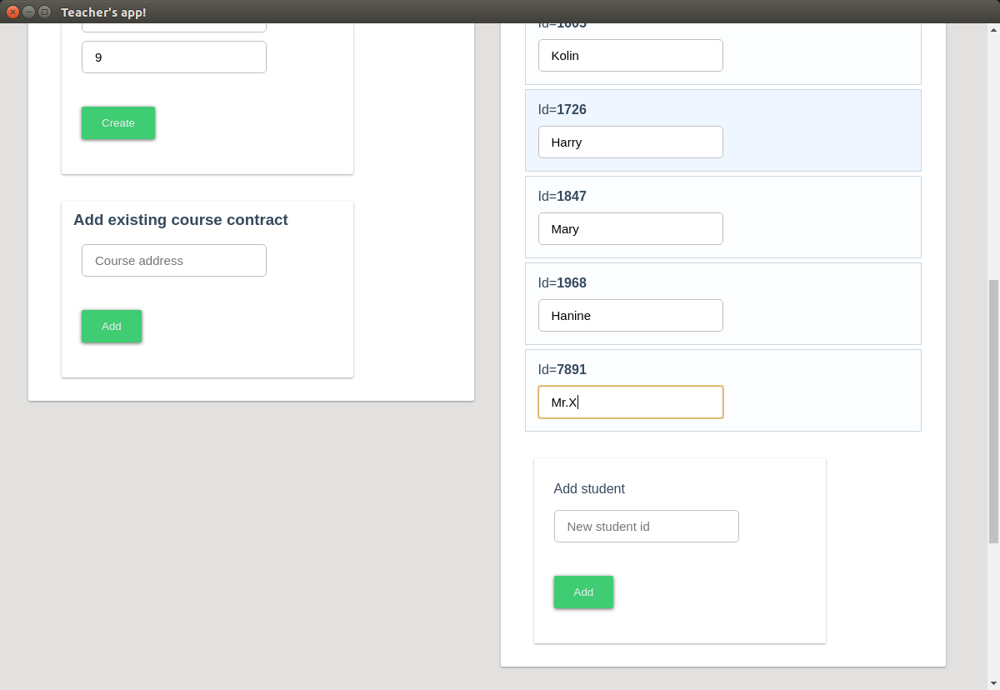
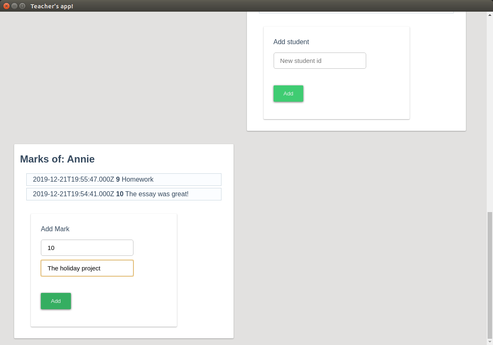
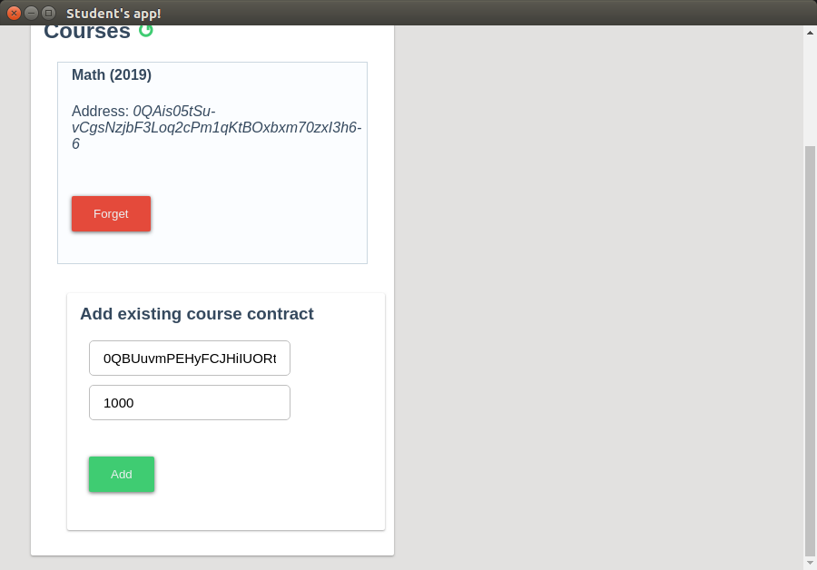
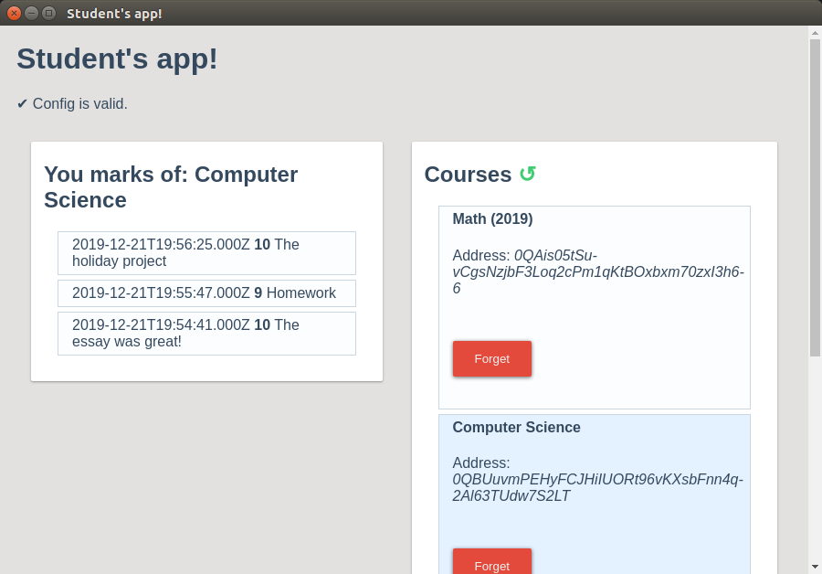

# School register project

#### Author: Andrei Marchenko <ftkvyn@gmail.com>, @ftkvyn, [LinkedIn](https://www.linkedin.com/in/ftkvyn/)

## Short description

The goal of the project is to implement the register for giving grades to the students in a school or university. The grades are stored in TON blockchain. It is not possible to remove or to edit the grade after it was given. It's also not possible to fake the grades.

## Components

### On-chain

Following instruments are working on TON blockchain:

*	Smartcontract 
	*	**register.fc** - creates and stores the students and the grades.
*	Fift scripts 
	*	**new-register.fif** - creates new register smart contract
	*	**new-student.fif** - adds a student to the existing register smart contract
	*	**new-mark.fif** - gives a new mark to the student on the existing register

Each register contract stores two keys - teacher's one and the principal's. The teacher's key is used to add students and to give grades. In case when the teacher should transfer her register to another teacher - the teacher's key may be changed. Both teacher and principal may do this. In case when the teacher is not avaliable - the principal may also transfer the register to another teacher. 

The grades are only created - after the creation it's not possible to remove or change it. It was made on purpose to ensure honesty of the register usage and to prevent any possible frauds and machinations.

The project was made with the assumption that the student's grade is not a secret or sencitive information. That's why the grades are avaliable as-is, without any encription.

### Off-chain

* Teacher's application
	*	Creates and manage several registers (for different classes and subjects)
	*	Displays list of students for each register
	*	Adds new students
	*	Displays student's marks
	*	Gives marks
* Student's application
	*	Handles several existing register
	*	Displays the single student's marks in given register

## Requirements

Applications are developed and tested on Ubuntu Linux, correct work on other systems is not guaraneed.
To be able to build and run scripts and to be able to use teacher's and student's application following requirements have to be fulfilled:

* Build TON libraries (`lite-client`, `fift` and `func`) as described in the instruction on [https://test.ton.org/](https://test.ton.org/);
* Set up correct `FIFTPATH`;
* Set up links to `fift` and `func` so that they can be used from the command line.
* For now the applications save their generated files (private keys, contract addresses and .boc files to upload to the blockchain) to the directory from which they are runned, so they need to have write permissions for their directories.

## Build instructions

### Crypto

To build fift scripts from sources, run

```
./build-crypto.sh
```

### Applications

Enter the application folder, `/src/teacher-app` or `/src/student-app`, run

```
npm install
npm start
```

## Instructions

### Teacher's app

First, config file should be set up. It is located in the file `/src/teacher-app/config.json`. It should have following sections:

* `"lite-client-config"` - path to the configuration file of lite-client.
* `"lite-client-bin"` - path to the binary file of the lite-client.
* `"data-storage"` - file that stores application's data, the application needs to have read and write permissions for this file.
* `"fift-folder"` - folder with all the fift scripts that are used by the application. May be set to `/dist` folder of current repo folder.

If something is not correct in the configuration, it will be displayed on the application's screen:



First, we are creating a new register contract:


The contract is created:



To Use it we need to transfer some funds to it's address ([0QBUuvmPEHyFCJHiIUORt96vKXsbFnn4q-2Al63TUdw7S2LT](https://test.ton.org/testnet/account?account=0QBUuvmPEHyFCJHiIUORt96vKXsbFnn4q-2Al63TUdw7S2LT)) and then click "Deploy". Then we wait some time while the payment and init message are processed and voilà, the contract is created and ready to be used:



We may click on the contract to select it. Then a list of students will appear on the right side. Student names aren't stored in the blockchain, only in the application's local data storage.



We may add new students as well:



To refresh the students list click on the contract again. The new student will appear when it will be saved in the blockchain.



Now we may select a student and we'll see her marks and we'll be able to give her new ones. It takes some time for new grades to be saved to the blockchain, so be patient ;)



### Student's app

Student's application is a somewhat reduced version of the teacher's one. It can't deploy new contracts and can't give grades. The configuration is similar to the teacher's app, the only difference is that student's one doesn't need "fift-folder" configuration entry. And for sure it has to have it's own separate file for data storage.

In the student's app we need to provide the information about the register that is to be used. The student should get from the teacher the contract address and her own id:



She then will be able to select the contract and see her grades:




## Final remarks

The applications code is pretty ugly because I didn't want to spend time for it now, preferring to give more attention to the smartcontract's code - fift and func. So please don't judge UI and my javaScript in these submissions - I know that it's horrible and before giving the applications to the real users I'll write much better code and do also much better UI. Applications in the current form are only proof of concepts and not all possibilities that are implemented in the smart contracts and fift scripts present in the apps.